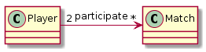

**Table of Contents**

- [Concept](#concept)
  - [Project structure](#project-structure)
  - [Implementation](#implementation)
    - [Database Layer](#database-layer)
    - [Service Layer](#service-layer)

# Concept

## Project structure

- tournament/
    - tournament_test.py - containing our test cases
    - tournament.py - is our python-db api for initiating db queries
    - tournament.sql - contains our sql queries

## Implementation

### Database Layer

One player can participate in multiple matches.
One match has exactly 2 players.



As we see in the model, we just need two tables. So we will do two CREATE statements inside
our tournament.sql file:

```
CREATE TABLE players (id SERIAL primary key, name TEXT);
CREATE TABLE matches (id SERIAL primary key,
                      winner INTEGER REFERENCES players (id),
                      loser INTEGER REFERENCES players (id));
```

### Service Layer

Let's implement our python functions, which you will find inside tournament.py.
But before I implemented them I used the console (psql) to test the queries first!

```
def deleteMatches():
    """Remove all the match records from the database."""
    connection = connect()
    db_cursor = connection.cursor()
    query = "DELETE FROM matches;"
    db_cursor.execute(query)
    connection.commit()
    connection.close()

def deletePlayers():
    """Remove all the player records from the database."""
    connection = connect()
    db_cursor = connection.cursor()
    query = "DELETE FROM players;"
    db_cursor.execute(query)
    connection.commit()
    connection.close()

def countPlayers():
    """Returns the number of players currently registered."""
    connection = connect()
    db_cursor = connection.cursor()
    query = "SELECT count(*) FROM players;"
    db_cursor.execute(query)
    num_players = db_cursor.fetchall()[0][0]
    connection.commit()
    connection.close()
    return num_players

def registerPlayer(name):
    """Adds a player to the tournament database.

    The database assigns a unique serial id number for the player.  (This
    should be handled by your SQL database schema, not in your Python code.)

    Args:
      name: the player's full name (need not be unique).
    """
    connection = connect()
    db_cursor = connection.cursor()
    query = "INSERT INTO players (name) VALUES ('%s');" % name
    db_cursor.execute(query)
    connection.commit()
    connection.close()

def reportMatch(winner, loser):
    """Records the outcome of a single match between two players.

    Args:
      winner:  the id number of the player who won
      loser:  the id number of the player who lost
    """
    connection = connect()
    db_cursor = connection.cursor()
    query = "INSERT INTO matches (winner, loser) VALUES (%s,%s);" % (winner, loser)
    db_cursor.execute(query)
    connection.commit()
    connection.close()

```

Great! Now we can test! Just type `python tournmament_test.py` to call the
test functions. You can de-comment the tests that you don't need. That way it is
easier to test single functions.

To keep things simple lets create our own test function:

```
def testCustom():

    """
    Before running this function I called tournament.sql to reset the database.
    Which means dropping the tables and creating them again.
    """

    # first lets delete the data from the tables
    deleteMatches()
    deletePlayers()

    # now lets register some players (inserts)
    registerPlayer("Twilight Sparkle")
    registerPlayer("Fluttershy")
    registerPlayer("Applejack")
    registerPlayer("Pinkie Pie")
    registerPlayer("Rarity")
    registerPlayer("Rainbow Dash")
    registerPlayer("Princess Celestia")
    registerPlayer("Princess Luna")

    # insert some winners and losers
    reportMatch(1, 2)
    reportMatch(3, 4)
    reportMatch(5, 6)
    reportMatch(7, 8)
```

Alright! If we for example type `select * from players;` in our console,
we should get something like:

```
id |      name                      
---+------------------
 1 | Twilight Sparkle
 2 | Fluttershy
 3 | Applejack
 4 | Pinkie Pie
 5 | Rarity
 6 | Rainbow Dash
 7 | Princess Celestia
 8 | Princess Luna
```

Now lets get to the most important part. The `playerStandings()` function.
This function has to return a list of tuples, each of which contains (id, name, wins, matches):
* id: the player's unique id (assigned by the database)
* name: the player's full name (as registered)
* wins: the number of matches the player has won
* matches: the number of matches the player has played

To understand this better we can create two little tables.
The first with id, name and matches_won, which looks like this:
```
id |       name        | matches_won
---+-------------------+-------------
 5 | Rarity            |           1
 2 | Fluttershy        |           0
 8 | Princess Luna     |           0
 4 | Pinkie Pie        |           0
 6 | Rainbow Dash      |           0
 3 | Applejack         |           1
 1 | Twilight Sparkle  |           1
 7 | Princess Celestia |           1
```

and a second one which should look like this:

```
id |       name        | matches_played
---+-------------------+----------------
 5 | Rarity            |              1
 2 | Fluttershy        |              1
 8 | Princess Luna     |              1
 4 | Pinkie Pie        |              1
 6 | Rainbow Dash      |              1
 3 | Applejack         |              1
 1 | Twilight Sparkle  |              1
 7 | Princess Celestia |              1
```

And if we have those two tables we can join them into one.
This is where VIEWS come in. We can create 2 VIEWS and then join them.
The SQL for that would look like this:

```
CREATE VIEW v_matchesWon AS
SELECT players.id, players.name, count(matches.winner) as matches_won
FROM players LEFT JOIN matches
ON players.id = matches.winner
GROUP BY players.id,players.name;

CREATE VIEW v_matchesPlayed AS
SELECT players.id, players.name, count(matches.id) as matches_played
FROM players LEFT JOIN matches
ON players.id = matches.winner or players.id = matches.loser
GROUP BY players.id,players.name;
```

Now we can join those 2 VIEWS into one 'Standings' table!

```
CREATE VIEW v_playerstandings AS
SELECT v_matcheswon.id, v_matcheswon.name,
       v_matcheswon.matches_won, v_matchesplayed.matches_played
FROM v_matcheswon LEFT JOIN v_matchesplayed
ON v_matcheswon.id = v_matchesplayed.id
AND v_matcheswon.name = v_matchesplayed.name
ORDER BY v_matcheswon.matches_won DESC;
```

But there are also other solutions we could use. It would also work with two subqueries like this:

```
CREATE VIEW v_playerstandings as
SELECT players.id, players.name,
(SELECT count(*) FROM matches WHERE matches.winner = players.id) as matches_won,
(SELECT count(*) FROM matches WHERE players.id = matches.winner or players.id = matches.loser) as matches_played
FROM players
GROUP BY players.id, players.name
ORDER BY matches_won DESC;
```

Now we have our standings table!

The last thing to do is to sort it by the number of wins. So at the end of the
view `v_playerstandings` we just add `ORDER BY v_matcheswon.matches_won DESC;`

Now we can implement our `playerStandings()` function!

```
def playerStandings():
    """Returns a list of the players and their win records, sorted by wins.

    The first entry in the list should be the player in first place, or a player
    tied for first place if there is currently a tie.

    Returns:
      A list of tuples, each of which contains (id, name, wins, matches):
        id: the player's unique id (assigned by the database)
        name: the player's full name (as registered)
        wins: the number of matches the player has won
        matches: the number of matches the player has played
    """
    connection = connect()
    db_cursor = connection.cursor()
    query = "SELECT * FROM v_playerstandings;"
    db_cursor.execute(query)
    standings = db_cursor.fetchall()
    connection.commit()
    connection.close()
    return standings
```

The last function to implement is the `swissPairings()` function.
We can use just python here. Because our table is already ordered by total wins,
we just have to put each row in a tuple and the tuple into a list.

```
def swissPairings():
    """Returns a list of pairs of players for the next round of a match.

    Assuming that there are an even number of players registered, each player
    appears exactly once in the pairings.  Each player is paired with another
    player with an equal or nearly-equal win record, that is, a player adjacent
    to him or her in the standings.

    Returns:
      A list of tuples, each of which contains (id1, name1, id2, name2)
        id1: the first player's unique id
        name1: the first player's name
        id2: the second player's unique id
        name2: the second player's name
    """

    pairings = []
    all_standings = playerStandings()
    if countPlayers() % 2 == 0:
        # this for loop is equivalent to for(i=0,i<all_standings.length,i=i+2)
        for i in range(0, len(all_standings)-1, 2):
            pairing_tuple=(all_standings[i][0],all_standings[i][1],all_standings[i+1][0],all_standings[i+1][1])
            pairings.append(pairing_tuple)

    return pairings
```
